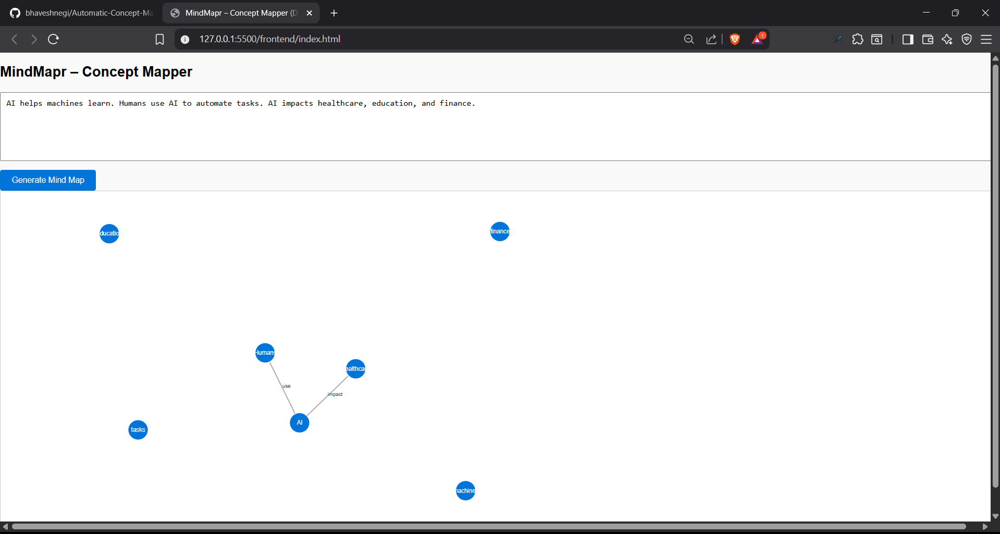

**MindMapr – Concept Mapper (D3.js)**

**Tagline:** Visualize your thoughts, ideas, and concepts like never before!

**Description:**

MindMapr is a web-based concept mapping tool that helps users generate visual representations of their thoughts, ideas, and concepts. Built using Python, Flask, and D3.js, this project aims to provide a user-friendly interface for creating mind maps, perfect for brainstorming, note-taking, and idea generation. With MindMapr, you can easily organize and connect your thoughts, making it easier to structure and communicate complex ideas.

MindMapr is designed to be flexible and extensible, allowing users to customize the appearance and behavior of their mind maps. The tool uses natural language processing (NLP) to identify key concepts and relationships, enabling users to generate high-quality visualizations with minimal effort.

**Tech Stack:**

| Frontend | Backend | Tools |
| --- | --- | --- |
| HTML5, CSS3, JavaScript (D3.js) | Python (Flask) | Spacy (NLP library), Flask-CORS |

📁 **Project Structure:**

```
Automatic-Concept-Mapper/
backend/
	app.py
	nlp_processor.py
	requirements.txt
data/
	sample_text.txt
frontend/
	script.js
	style.css
	index.html
README.md
.gitignore
```

* `app.py`: The Flask web application that handles requests and routes.
* `nlp_processor.py`: The Python script that performs NLP tasks, such as extracting concepts and relationships.
* `script.js`: The JavaScript file that generates the mind map visualization using D3.js.
* `style.css`: The CSS file that styles the web interface.
* `index.html`: The HTML file that serves as the entry point for the web application.
* `requirements.txt`: The file that lists the project's dependencies.
* `README.md`: This file!

**How to Run:**

1. **Backend Setup**:
	* cd backend folder
	* python -m venv venv
	* On Windows: venv\Scripts\activate
	* Install the required dependencies by running `pip install -r requirements.txt`.
	* Start the Flask development server by running `python app.py`.
2. **Frontend Setup**:
	* Open frontend/index.html directly in a browser, or
	* Run a static server:
		* cd frontend
		* python -m http.server 8080
	* Open http://localhost:8080 in your browser.
3. **Environment**:
	* Make sure you have Python 3.8 or later installed.
	* Ensure that the directory containing the project files is in your system's PATH.
4. **Build**:
	* Run `python app.py` to start the Flask development server.


** How to Use**

1. Type or paste text into the textarea.
2. Click the "Generate Mind Map" button.
3. The browser will render an interactive, zoomable mind map of concepts and relationships using D3.js.
4. The mind map should be generated and displayed in the browser.

Example input:
"AI helps machines learn. Humans use AI to automate tasks."


**Screenshots:**


**API Reference:**

* `POST /mindmap`: Generates a mind map based on the input text.
* `GET /mindmap`: Returns the generated mind map as a JSON object.

**Author:**

* Name: Bhavesh Negi
* Email: bhaveshnegi98@gmail.com
* GitHub: https://github.com/bhaveshnegi
